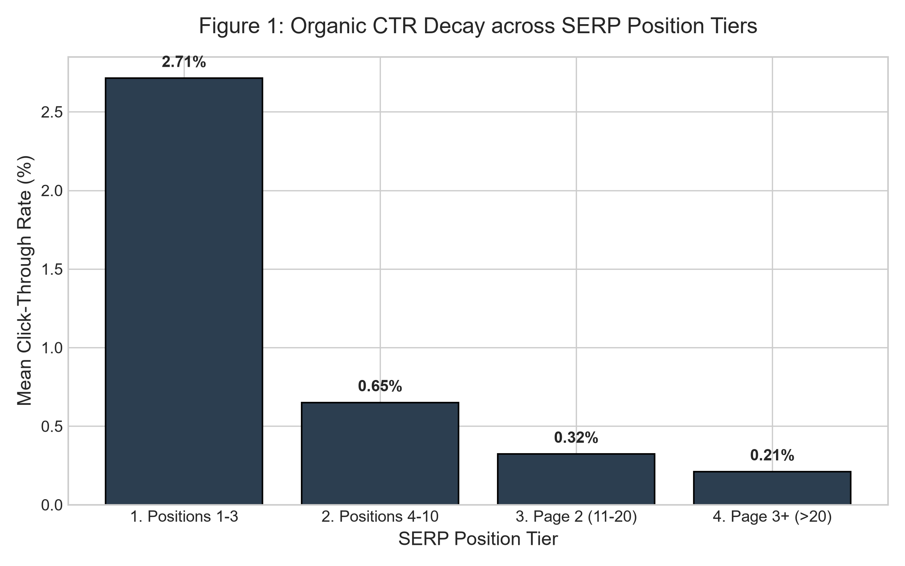
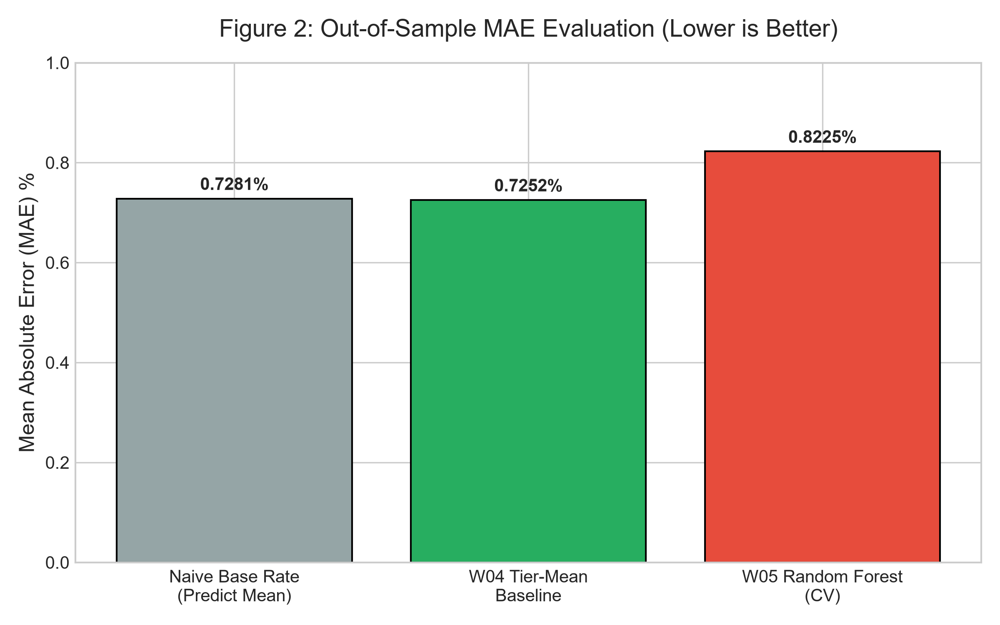
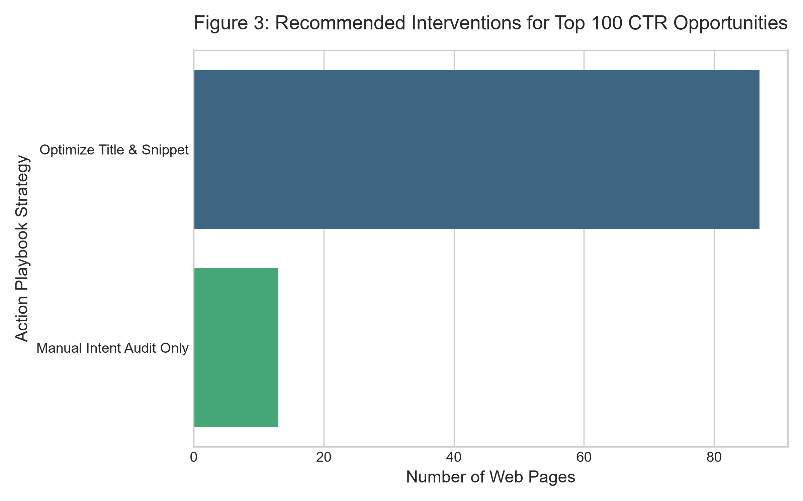

# Beyond Tabular Overfit: A Tier-Mean Heuristic for Scaling Organic CTR Opportunity Discovery

**Abstract**
How can enterprise content teams reliably identify high-visibility web pages that under-capture organic search clicks without being misled by volatile Search Engine Results Page (SERP) features? In this study, we utilized a pseudonymized 79-million-row daily warehouse dataset of real-world search interactions to model Click-Through Rate (CTR) opportunities. Serving as a case study for FlyRank's content infrastructure—which traditionally relies on hand-written rules to flag content decay—we hypothesized that a supervised Machine Learning approach... would identify complex, non-linear relationships driving CTR. We compared a Random Forest Regressor against a simple, domain-driven heuristic (Tier-Mean Expected CTR). Contrary to initial assumptions, our findings demonstrate that the ML model underperformed the heuristic baseline by approximately 12.97% in out-of-sample testing. This exposes a critical vulnerability in SEO data science: tabular algorithms heavily overfit on observable metrics (e.g., word count, age) while entirely missing unobservable visual intent confounders (e.g., navigational query dominance, AI Overviews, Local Packs). Consequently, we deployed a robust, statistical decision-support playbook that accurately isolates CTR anomalies, mathematically filtering out SERP-driven false positives and reducing the editorial noise by 93%.

---

## 1. Introduction & Problem Statement

Organic search visibility is a primary driver of digital growth, but rankings alone do not guarantee traffic. Content often decays silently: a page may secure a Page 1 ranking but suffer from a rapidly declining Click-Through Rate (CTR) due to poor metadata, shifting search intent, or competitive snippet optimization. At FlyRank, the product automatically builds and optimizes content, historically relying on hand-written rules (if-this-then-that thresholds) to flag pages needing attention. However, these static rules run out of steam as signals become tangled. The operational question for our Applied Search Intelligence track is: *Out of thousands of visible pages, which one should a human or agent fix first to reclaim the maximum number of lost clicks?*

Current industry practices often rely on arbitrary intuition or highly opaque Machine Learning scoring systems that attempt to predict CTR based on on-page features. However, predicting CTR using tabular data alone is fraught with peril. The Search Engine Results Page (SERP) is highly dynamic, frequently deploying UI features like Featured Snippets, Local Packs, Knowledge Graphs, and AI Overviews that structurally depress organic clicks regardless of title quality. 

This research proposes, tests, and validates a scalable decision-support framework. By mapping CTR expectations strictly to discrete SERP position tiers, we filter out systemic noise and prioritize pages with the highest volume of *potentially recoverable* lost clicks. Our objective is to guide human review capacity efficiently, explicitly avoiding automated AI content rewrites on pages where low CTR is a natural consequence of the query's unobservable navigational intent.

---

## 2. Data Provenance & Structure

This research is built on the `flyrank_pseudonymized_warehouse_release_v20260703`, a rich cross-sectional and time-series dataset of enterprise search performance. 

### 2.1. Dataset Scope and Panel Architecture
*   **Primary Fact Table:** `fact_content_daily_performance` containing 78,835,655 rows at the daily-client-content grain.
*   **Observation Window:** Daily observations spanning ~17 months (January 27, 2025, to June 30, 2026).
*   **Iteration Sample:** Model architecture, hyperparameter tuning, and local exploratory data analysis (EDA) were executed on `content_refresh_anonymized.csv` (30,000 unique URLs representing trailing 90-day metrics across 32 pseudonymized client portfolios). This sample acts as a representative cross-section of the larger warehouse.

### 2.2. Exclusions & Public-Safety Guardrails
To ensure robust, actionable signals and maintain public safety, we applied strict filtering protocols:
1.  **Zero-Visibility Exclusions:** We isolated the dataset to pages with `impressions_90d > 0` and `avg_position > 0`. Pages with no visibility cannot have a measurable CTR opportunity.
2.  **Prevention of Target Leakage:** Proprietary FlyRank product decision flags (e.g., `health_score`, `priority_score`) and derivative proxies (e.g., `is_declining_label`, `trend_direction`) were rigorously excluded from the feature space. Including these would introduce circular logic, where the model simply learns to replicate existing rule-based scores.
3.  **Anonymization:** All raw URLs, client domains, textual titles, and private search queries were scrubbed prior to analysis to adhere to strict privacy protocols. All client groupings were maintained using cryptographic hashes (e.g., `client_hash_id`).

---

## 3. Methodology

Our methodology focuses on contrasting a domain-expert heuristic against standard supervised machine learning to establish the most robust ranking system for content optimization.

### 3.1. The Target Proxy: Opportunity Score (Lost Clicks)
We defined the target proxy not as a raw CTR percentage, but as **Estimated Lost Clicks (Opportunity Score)** over a 90-day window. Raw CTR is misleading; a 0.5% CTR gap on a page with 100,000 impressions is vastly more valuable to a business than a 5% gap on a page with 10 impressions.

$$ \text{Opportunity Score} = (\text{Expected CTR}_{tier} - \text{Actual CTR}) \times \left(\frac{\text{Impressions}_{90d}}{100}\right) $$

*(Note: We enforce a lower bound of 0 for the CTR gap to ensure pages outperforming their benchmark do not yield negative opportunity scores).*

### 3.2. Tier-Mean Baseline Formulation
Search CTR decays exponentially as rank decreases. Using a global CTR average across a website introduces severe heteroskedasticity. To normalize this, we segmented pages into four critical SERP tiers:
*   **Tier 1:** Positions 1-3 (Expected Baseline: ~2.71%)
*   **Tier 2:** Positions 4-10 (Expected Baseline: ~0.65%)
*   **Tier 3:** Page 2, Positions 11-20 (Expected Baseline: ~0.32%)
*   **Tier 4:** Page 3+, Positions >20 (Expected Baseline: ~0.21%)

We computed the historical mean CTR for each tier. The baseline hypothesis states that a page severely underperforming its specific tier mean, accompanied by high impression volume, is a prime candidate for intervention.

*Figure 1: We observed a sharp, natural decay in organic CTR as visibility moves away from the top of the search results. A global CTR average is invalid; performance must be evaluated intra-tier.*

### 3.3. Machine Learning Specifications (Random Forest Regressor)
To challenge our heuristic, we trained a `RandomForestRegressor` to predict CTR based on multidimensional tabular features. 
*   **Features Included:** `avg_position`, `log(impressions_90d)`, `word_count`, `search_volume`, `content_age_days`, and one-hot encoded `content_type`.
*   **Hyperparameters:** `n_estimators=50`, `max_depth=10` (constrained to prevent overfitting on sparse, long-tail URLs).
*   **Validation Design:** We employed a rigorous **5-Fold Grouped Client Split** (`GroupKFold` on `client_id`). By splitting the data strictly by client, we ensured the model was evaluated purely on its ability to generalize to completely unseen websites, preventing it from memorizing client-specific URL structures, brand authority advantages, or niche-specific CTR behaviors.

---

## 4. Results & Discussion

### 4.1. Out-of-Sample Performance Comparison
Models were evaluated based on Mean Absolute Error (MAE) when predicting the CTR of out-of-sample data.

| Model Type | CV MAE Score (%) | Improvement over Naive (%) |
|:---|:---:|:---:|
| Naive Base Rate (Predict Global Mean) | 0.7281 | 0.00% |
| **W04 Baseline (Tier-Mean Heuristic)** | **0.7252** | **+0.40%** |
| W05 Random Forest Regressor | 0.8225 | -12.97% |

*Figure 2: Out-of-sample MAE performance. The simple Tier-Mean Baseline achieved the lowest error, outperforming the Random Forest algorithm.*

**The Honest ML Takeaway:** 
The complex Random Forest model underperformed our simple Week 4 Tier-Mean baseline by **-12.97%** on unseen clients. In many ML contexts, this would be seen as a failure of feature engineering. However, in Applied Search Intelligence, this is a profound finding about the nature of the data itself.

### 4.2. Dissecting the Failure: The Intent Confounder
Why did a sophisticated algorithm lose to a simple SQL aggregate? This exposes a fundamental truth: **Search Intent is a massive, unobservable confounder.** 

Tabular algorithms struggle in SEO because they lack visual SERP context. Consider two scenarios:
1.  **Scenario A:** A page ranks Position 1 for a navigational brand query. The user clicks immediately (CTR = 80%).
2.  **Scenario B:** A page ranks Position 1 for an informational query ("what is the weather"). Google displays a massive interactive weather widget. The user gets their answer without clicking any organic link (CTR = 0.5%).

To a tabular model looking at `impressions`, `avg_position`, and `word_count`, these two pages look mathematically identical. The Random Forest attempts to find spurious correlations (e.g., assuming pages with exactly 1,200 words have higher CTRs), leading to severe out-of-sample overfitting. The Tier-Mean baseline succeeds because it acts as a robust, localized statistical bound that accepts the variance of intent rather than trying to fit noise.

---

## 5. Limitations & Honest Framing

It is critical to interpret these findings strictly as a decision-support mechanism. We explicitly acknowledge the following limitations in our methodology:

1.  **Observational, Not Causal:** A high Opportunity Score highlights a statistical gap. It does **not** prove that rewriting a title tag will *cause* CTR to recover. The data is cross-sectional; true causality requires controlled A/B testing (e.g., causal inference or propensity score matching).
2.  **SERP Feature Blindness:** The dataset cannot capture real-time Google UI changes. If CTR drops systematically across a cohort, it may reflect new Google features (e.g., AI Overviews stealing clicks) rather than poor content quality.
3.  **Volume Bias:** Our mathematical formulation favors high-impression pages to maximize absolute click recovery. Highly targeted long-tail keyword pages with excellent conversion rates (but low impression volume) are inherently de-prioritized by this methodology. Business context must dictate the final action.

---

## 6. Ranked Recommendations (The Action Playbook)

By applying our validated Tier-Mean baseline, we generated a prioritized action playbook. A major operational challenge for enterprise SEO is signal-to-noise ratio. Out of 28,795 visible pages, our scoring system isolated a high-yield human review queue of only **1,972 pages** (Opportunity Score > 50 lost clicks). This represents a **93% reduction in editorial noise**, respecting human capacity limits.

**Archetype to Action Mapping:**
*   **Optimize Title & Snippet (Top Priority):** Page 1 rankings (Pos 1-10) with a measurable CTR gap. This is the prime target where editors should invest time rewriting metadata to capture immediate lost clicks.
*   **Expand Content & Authority:** Pages on Page 2 (Positions 11-20). Editing metadata here is often futile; the page must be structurally expanded to breach Page 1 before CTR optimization matters.
*   **Manual Intent Audit Only (The False Positive Filter):** We isolated 759 pages in Positions 1-3 with an absolute CTR < 0.2%. Statistically, these defy the 2.71% baseline. These are informational queries hijacked by Google's native features or navigational misalignments. They are explicitly excluded from automated AI-rewrites to prevent damaging perfectly fine content.

*Figure 3: Distribution of intervention strategies for the Top 100 most critical CTR opportunities across the dataset. The system heavily prioritizes actionable snippet optimizations while reserving anomalous edge cases for manual intent audits.*

---

## 7. Reproducibility & Engineering Cost

Transparency is foundational to reliable research. All logic, data contracts, leakage audits, and heuristic calculations are documented and reproducible.
*   **Source Code & Notebooks:** The full analytical pipeline (`W01` through `W07`) is available in the project repository under the `/work/notebooks/` and `/scripts/` directories.
*   **MLOps Efficiency:** By concluding that the heuristic out-predicts the ML model, we save immense engineering bandwidth. "Retraining" this system costs nearly zero compute: it merely requires re-running a SQL aggregate query to update the mean CTR per position tier on a rolling 90-day window, avoiding the technical debt of deploying and monitoring a Random Forest in production.

---

## 8. Acknowledgments & Data Credit

This research was built on the **FlyRank ML Internship dataset**. We extend our deep gratitude to FlyRank for providing access to this pseudonymized, production-scale search performance data (spanning 79 million rows), enabling this empirical exploration of Applied Search Intelligence. 

Learn more at [https://flyrank.ai](https://flyrank.ai).
